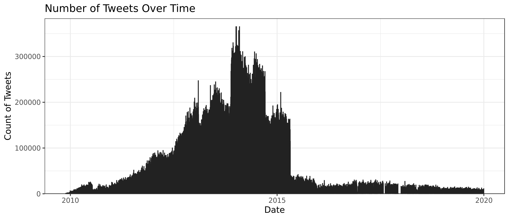
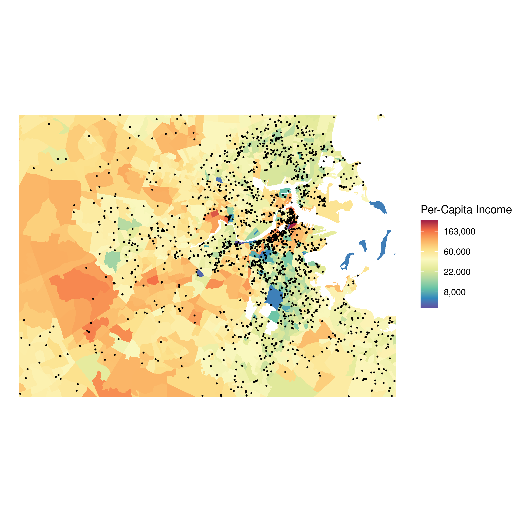

We explored the impact of temperature and precipitation on expressed sentiment on twitter.  This is an initial overview.  The code is [here](https://github.com/mcooper/temp-sentiment)

This work is heavily influenced by previous research finding a link between weather and twitter sentiment, especially work by Patrick Baylis (See [here](https://doi.org/10.1371/journal.pone.0195750), [here](https://doi.org/10.1016/j.jpubeco.2020.104161)).  However, this work builds on that work in several ways:

* We more precisely measure temperature
  * We take into account the Heat Index, which is more indicative of temperature stress than raw temperature
  * We infer the hourly temperature, rather than using the daily maximum temperature
  * We get more local temperature, at each PRISM grid cell, rather than at CBSA
* We run tweet-level models without aggregating the data
* We examine factors that moderate the effect of weather, to explore heterogeneities in vulnerability

All of this work was done in the cloud and this would not have been possible without a generous grant from Microsoft's [AI for Earth](https://www.microsoft.com/en-us/ai/ai-for-earth) Program.

# Data

## Twitter Data
We use about 240 million tweets from the University of Vermont.  This is every geolocated tweet that they have from 2009-2019 in the lower 48.  This only includes tweets where the location is specifically supplied by the user, and does not include tweets where location is inferred from the user profile.  Because twitter has made it easier for users to opt-out of geolocation in recent years, the data is mostly from the early-mid 2010s.

For each tweet, we calculated the sentiment in the text of the tweet using the following methods:

* afinn
* textblob
* hedonometer
* vader
* sen
* wkwsci

We also tagged tweets as including weather terms or not, so those tweets could be excluded.

## Climate Data

We use climate data from [PRISM](https://prism.oregonstate.edu/), including precipitation and daily highs and lows of temperature and vapor pressure deficit.  We extract data for the day of each tweet from PRISM, taking into account the different time zones between tweet location and UTC, using Google Earth Engine.

We then calculate relative humidity from temperature and vapor pressure deficit using an equation from Dennis Hartman "Global Physical Climatology" (p 350),  from [this](https://physics.stackexchange.com/questions/4343/how-can-i-calculate-vapor-pressure-deficit-from-temperature-and-relative-humidit) Stack Exchange answer.  Using relative humidity, we can get the Heat Index, 
using `weathermetrics::heat.index()` in R, which is based on the National Weather Service official equations for the Heat Index.  This is a very similar method to using Wet Bulb Temperature, which is also popular among environmental health researchers.

Then, we use the hour of the tweet and estimated hours of the daily minimum and maximum temperature to get the heat index temperature at the time of the tweet, based on [Linville 1990](https://journals.ashs.org/hortsci/view/journals/hortsci/25/1/article-p14.xml).  Basically, we assume the minimum temperature occurs at sunrise and increases sinusoidally, peaking two hours after solar noon, and then falls logarithmically after sunset.  In some cases the minimum daily temperature can occur after sunset and there's really no way we can correct for this, but I think this is a good way to proxy temperature at the time of the tweet and makes more sense than only using the daily maximum temperature.

## Local income per capita
Finally, we use year census data at the census block group scale to estimate income per capita, which each year's data converted to 2019 dollars.  The available data ends in 2018, so we use 2018 data for 2019.

\pagebreak

# Modeling Methods

We fit three models, with the Hedonometer score as the outcome variable, for: 

1. The effect of the Heat Index on sentiment (for all tweets where the heat index is > 20C)
2. The effect of the cold temperatures on sentiment (for all tweets where the temperature is < 20C)
3. The effect of the precipitation on sentiment.

For each model, we fit a separate slope and intercept for income quintile. We also controlled for fixed effects at several levels:

1. At the county level, to control for spatial effects in people's climate baselines and baselines in sentiment
2. At the day-of-week level, to control for weekend/weekday effects
3. At the day-of-year level, to control for seasonal and holiday effects.  Rather than using the julian day, we use the calendar day, so that Christmas and other holidays will always be counted the same, even on leap years.
4. At the time-of-day level, grouped in ten-minute periods
5. Finally, we fit yearly fixed effects and linear across each year.

\pagebreak

#  Results
## Heat

\pagebreak

## Cold

\pagebreak

## Precipitation

\pagebreak

# Takeawayas

* Big consistent gaps by income group - money really does make you happy!
* Slopes are surprisingly parallel, maybe the story is that we are all *equally* vulnerable to the weather?
* There is an issue with hourly changes in sentiment and temperature.  Cold slopes the right way when there are no hourly fixed effects, and the wrong way when we include hourly fixed effects (See Appendix).  Hmm.

# Challenges and Next Steps

* Look at other factors influencing vulnerability, including:
  * Race, other census factors?
  * Green & Gray land cover
  * Account for age in income & poverty census estimates, to exclude [college towns](https://www.census.gov/library/stories/2018/10/off-campus-college-students-poverty.html)
* Robustness checks with other sentiment metrics & exclusion of weather terms

\pagebreak

# Appendix: Old Models Without Hourly Effects

